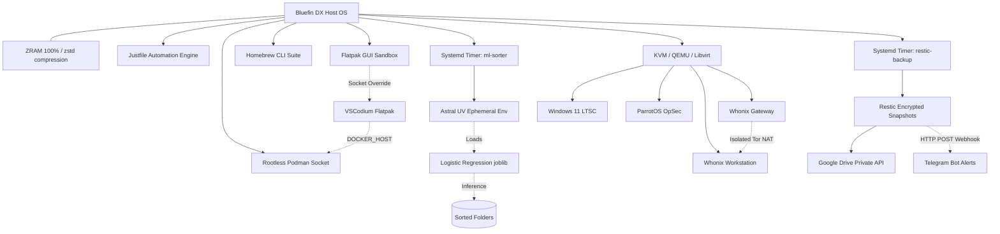

# 🚀 Bluefin DX: Automated & Immutable Productivity Workstation


> **The Engineer's Blueprint:** A fully automated, containerized, and zero-maintenance workstation setup built on Fedora Silverblue (Bluefin DX). Engineered for peak productivity, featuring a custom self-learning AI file sorter, ZRAM optimization, and enterprise-grade security.

---

## 🗺️ System Architecture



---

## ⚙️ Core Infrastructure Highlights

### 1. Immutable Host & Memory Management
*   **Zero Host Pollution:** Root filesystem `/` remains read-only.
*   **ZRAM Optimization:** Mapped to 100% of physical RAM (16GB DDR5) with `zstd` compression (`/etc/systemd/zram-generator.conf.d/99-custom.conf`).
*   **Kernel Swappiness:** Aggressively set to `vm.swappiness=100` (`/etc/sysctl.d/99-zram.conf`) to prioritize compressed RAM over disk paging.

### 2. Zero-Bloat Micro-ML File Sorter
*   **Architecture:** Replaced heavy LLMs with a lightweight, native Scikit-Learn `LogisticRegression` pipeline running locally on the CPU (Intel Core 5 210H).
*   **Feature Engineering:** Utilizes TF-IDF Vectorization with Character N-Grams (`char_wb`) to accurately categorize files (e.g., University assignments, Code assets) regardless of naming typos.
*   **Fail-Safe:** Implements a strict 90% confidence gate. Unrecognized files are routed to `~/_Review` instead of being misplaced.
*   **Execution:** Runs invisibly in the background via Systemd Timers and Astral `uv` for microsecond cold-starts.

### 3. Isolated Development Workspaces
*   **Flatpak VSCodium + Podman Integration:** Flatpak permissions overridden to grant direct access to rootless Podman runtime sockets.

### 4. OpSec & Specialized Virtualization (KVM)
*   **Whonix Architecture:** Two-tier VM network topology (Gateway + Workstation) forcing all traffic through Tor.
*   **ParrotOS & Windows 11 LTSC:** Lean environments configured for security testing and proprietary academic requirements.

### 5. Automated Backup & Disaster Recovery
*   **Dual-Layer Engine:** **Restic** (AES-256 encryption + deduplication) piped through **Rclone**.
*   **Throughput Tuning:** Configured with 16 parallel transfers and 64MB chunk sizes via a custom Google Cloud Client ID to avoid API rate limits.
*   **Automation:** Triggered automatically via **Systemd User Timers** with real-time Telegram status webhooks.

---

## 📂 Repository Layout

```text
.
├── README.md                  # Comprehensive architectural blueprint
├── justfile                   # Central workstation maintenance tasks
├── install.sh                 # Single-command provisioning script
├── train.py                   # Micro-ML model training script
├── inference.py               # Micro-ML background sorting logic
├── dataset.csv                # Few-shot learning reference data
├── configs/
│   ├── zram/                  # Memory & sysctl tuning parameters
│   └── systemd/               # User-level Systemd backup & ML timers
├── scripts/
│   └── automated-backup.sh    # Sanitized Restic/Rclone backup script
└── lists/
    ├── flatpaks.txt           # Declared Flatpak applications
    └── brew-leaves.txt        # Declared Homebrew CLI packages
```

---

## 🚀 Quickstart & Reproducibility

To provision a fresh Bluefin DX machine using this blueprint:

```bash
# 1. Clone repository
git clone [https://github.com/muehehe33333/mybluefin-dotfiles.git](https://github.com/muehehe33333/mybluefin-dotfiles.git)
cd mybluefin-dotfiles

# 2. Run automated bootstrap
./install.sh

# 3. Train the Micro-ML File Sorter
just build-ml

# 4. Configure secrets locally
# Edit ~/.local/bin/automated-backup to insert your Restic password and Telegram tokens.
```
