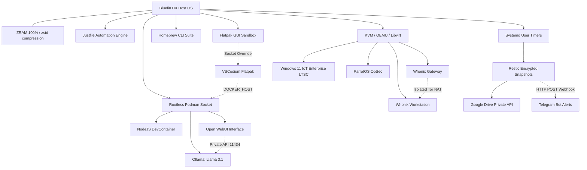

# 🚀 Bluefin DX: Automated & Immutable Productivity Workstation


> **The Engineer's Blueprint:** A fully automated, containerized, and tamper-proof workstation setup built on top of Fedora Silverblue (Bluefin DX). Engineered for peak development productivity, zero OS maintenance overhead, and enterprise-grade security.

---

## 🗺️ System Architecture



---

## ⚙️ Core Infrastructure Highlights

### 1. Immutable Host & Memory Management
*   **Zero Host Pollution:** Root filesystem `/` remains read-only.
*   **ZRAM Optimization:** Mapped to 100% of physical RAM capacity with `zstd` compression algorithm (`/etc/systemd/zram-generator.conf.d/99-custom.conf`).
*   **Kernel Swappiness:** Aggressively set to `vm.swappiness=100` (`/etc/sysctl.d/99-zram.conf`) to prioritize compressed RAM over disk paging.

### 2. Isolated Development Workspaces
*   **Flatpak VSCodium + Podman Integration:** Flatpak permissions overridden to grant direct access to rootless Podman runtime sockets.
*   **DevContainers:** Projects run within dedicated containers with no SDKs or runtimes installed directly on the host.

### 3. Hardware-Accelerated Local AI
*   **Ollama Engine:** Containerized deployment leveraging direct NVIDIA hardware GPU passthrough (`--device nvidia.com/gpu=all`).
*   **Model:** Meta Llama 3.1 served privately offline.
*   **Open WebUI:** Front-end dashboard linked across internal container bridge networking (`ai-network`).

### 4. OpSec & Specialized Virtualization (KVM)
*   **Whonix Architecture:** Two-tier VM network topology (Gateway + Workstation) forcing all traffic through Tor.
*   **ParrotOS:** Isolated security and penetration testing suite.
*   **Windows 11 LTSC:** Lean environment configured for proprietary academic/enterprise software requirements.

### 5. Automated Backup & Disaster Recovery
*   **Dual-Layer Engine:** **Restic** (AES-256 encryption + deduplication) piped through **Rclone**.
*   **Throughput Tuning:** Configured with 16 parallel transfers (`RCLONE_TRANSFERS=16`) and 64MB chunk sizes via a custom Google Cloud Client ID to avoid API rate limits.
*   **Automation:** Triggered automatically via **Systemd User Timers** with real-time Telegram status webhooks.

---

## 📂 Repository Layout

```text
.
├── README.md                  # Comprehensive architectural blueprint
├── justfile                   # Central workstation maintenance tasks
├── install.sh                 # Single-command provisioning script
├── configs/
│   ├── zram/                  # Memory & sysctl tuning parameters
│   └── systemd/               # User-level Systemd backup service & timer
├── scripts/
│   └── automated-backup.sh    # Sanitized Restic/Rclone backup script
└── lists/
    ├── flatpaks.txt           # Declared Flatpak applications
    └── brew-leaves.txt        # Declared Homebrew CLI packages
```

---

## 🚀 Quickstart & Reproducibility

To provision a fresh Bluefin DX machine using this blueprint:

```bash
# 1. Clone repository
git clone https://github.com/muehehe33333/mybluefin-dotfiles.git
cd mybluefin-dotfiles

# 2. Run automated bootstrap
./install.sh

# 3. Configure secrets locally
# Edit ~/.local/bin/automated-backup to insert your Restic password and Telegram tokens.
```

---
*Maintained by muehehe33333. Built for reliability and performance.*
